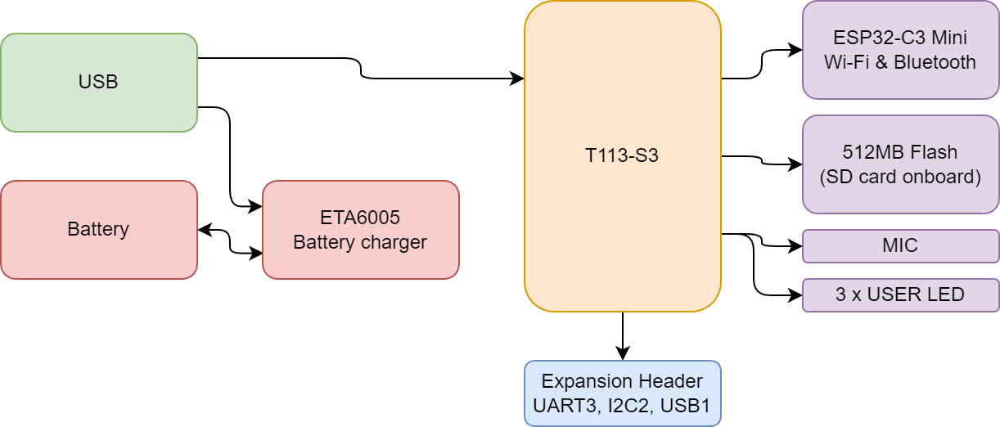
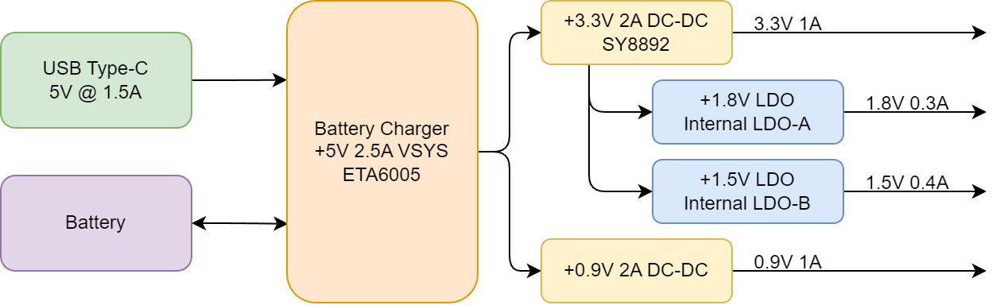
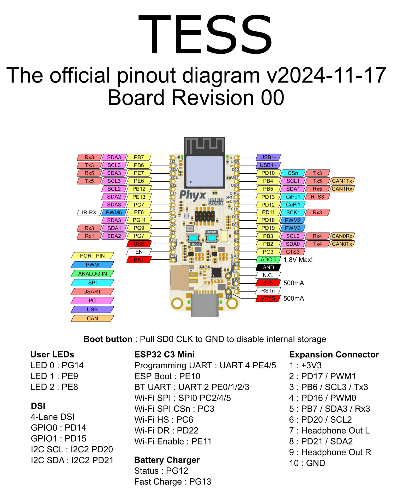

# TESS
## TESS
Adafruit Feather compatible embedded Linux board based on the Allwinner T113-S3 
SoC with 128MB DDR3 built-in. 

## Blockdiagram
TESS is designed to be a breakout board for the Allwinner T113-S3 with limited features on the board but maximal flexibility.

## Power
TESS has a 3.3V and 0.9V DC-DC regulator onboard whilst the T113-S3 has 2 LDO's built-in for the 1.8V and 1.5V rails.

## Pinout

